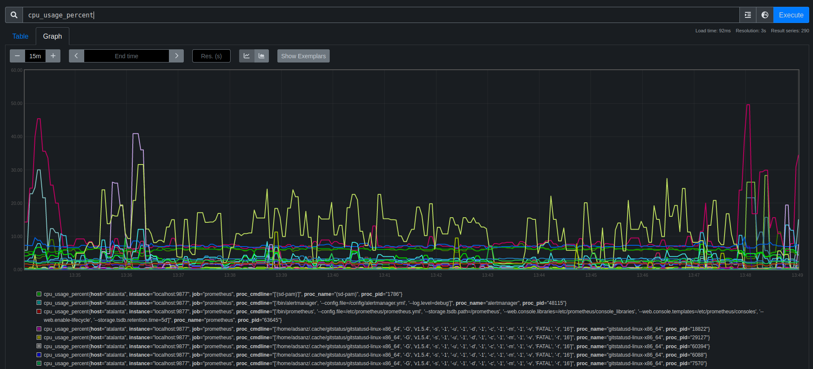
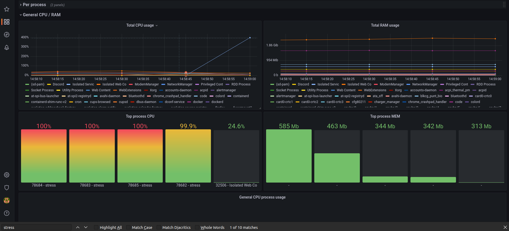

# Prometheus process CPU + RAM exporter

Like top, but on prometheus.

WARNING: This is for a very specific usecase, I do not recommend this exporter for multiple machines it will crash your grafana dashboards, and it will increase cardinality a lot!!

*THIS IS ON DEVELOPMENT STATUS, THIS EXPORTER MIGHT BREAK YOUR PROM/VM INSTANCE*




## USE CASE

In my case, I need to debug jenkin slaves and need to check improvement between runs, I don't want to be checking top, and I might need to repeat this set-up. I also came across another process-exporter but it was written in go, and it wasn't useful for my case, I need to know really precise information related to processes overtime, that means that I need to check them dinamically and not grouping by regex and stuff. 

That's why I made this python script which basically use 3 main packages:

- psutils: interacting with host proc FS
- prometheus_api_client: interact with prometheus API (no auth ATM, might be added)
- prometheus_client: serving metrics to prometheus as a exporter

## Usage

This is designed to be run ONLY on linux machines, I haven't tested it on mac or windows, feel free to add PRs I'll review them.

**VARIABLES**:
- `PROMETHEUS_HOST`: Your prometheus instance
- `EXPORTER_PORT`: The port where the exporter will attach
- `SCRAPE_TIME`: This setting should be set the same as the scrape time of your prom instance (recommended is above 10, less will cause high usage)

For usage, I recommend using docker! 

1. Docker build: 
```
docker build . -t process-exporter:latest
```

2. Docker run:
```
docker run --privileged --rm -d -v /proc:/proc_container -e PROMETHEUS_HOST=https://my.prom.com/ --name process-exporter --network host process-exporter:latest
```
## Metrics

Exposed at 9877 by default (you can change the port if you need to with `-e EXPORTER_PORT=10000`), the end-point is `/metrics` and the metrics exposed are:

```
# HELP memory_usage_bytes Memory used om bytes.
# TYPE memory_usage_bytes gauge

Ej:

memory_usage_bytes{host="atalanta",proc_cmdline="['/usr/libexec/evolution-source-registry']",proc_name="evolution-source-registry",proc_pid="2274",type="used"} 5.128192e+06
memory_usage_bytes{host="atalanta",proc_cmdline="['/usr/libexec/evolution-source-registry']",proc_name="evolution-source-registry",proc_pid="2274",type="swap"} 0.0
---
# HELP cpu_usage_percent CPU usage percent.
# TYPE cpu_usage_percent gauge

Ej:

cpu_usage_percent{host="atalanta",proc_cmdline="['/snap/firefox/2067/usr/lib/firefox/firefox', '-contentproc', '-childID', '479', '-isForBrowser', '-prefsLen', '31540', '-prefMapSize', '229220', '-jsInitLen', '246704', '-parentBuildID', '20221104181631', '-appDir', '/snap/firefox/2067/usr/lib/firefox/browser', '{ce6cf626-99ec-4399-b51f-71cdce8de6c6}', '4549', 'true', 'tab']",proc_name="Web Content",proc_pid="78798"} 0.0
---
# HELP memory_total_bytes Total memory in bytes.
# TYPE memory_total_bytes gauge

Ej:

memory_total_bytes{host="atalanta"} 1.6566857728e+010
```


## Why there's a variable pointing to your prometheus instance

There's a variable: `PROMETHEUS_HOST` which is the end-point of your prometheus instance, why? Well... 

I have this code here (this gets process info and export de values on /metrics):

```python
    def run_metrics_loop(self):
        """Metrics fetching loop"""
        while True:
            procs = {p for p in psutil.process_iter(['name', 'cmdline', 'pid'])}
            logging.info("Starting metrics loop")
            self.metrics.fetch(procs)
            time.sleep(5)
            self.metrics.cleaner(procs)
```

Everytime we iterate, we might get new values, but the old ones, might not get updated! (the exporter will export these time series with the same value 4ever) I noticed this while load testing, I finisihed running the test, but the process still showed with high CPU usage, even though the process didn't exist anymore that's why I came up with this:

```python
    def judge(self, prom_response, procs, type):
        """Compare the metrics on prometheus with the running processes and set to 0 the metrics of the processes that are not running and remove the labelset from prometheus"""

        proc_pid_list = [p.pid for p in procs]

        for metric in prom_response:
            proc_pid = int(metric['metric']['proc_pid'])
            if proc_pid not in proc_pid_list:
                name = metric['metric']['proc_name']
                cmdline = metric['metric']['proc_cmdline']
                host = metric['metric']['host']

                if type == "cpu":
                    logging.warning(f'[CPU JUDGE] Process {name} ({proc_pid}) cpu not found on system, set value to 0 & remove metric from pushgateway')
                    self.cpu_metric.labels(host, name, str(cmdline), proc_pid).set(0)
                    self.cpu_metric.remove(host, name, str(cmdline), proc_pid)
                elif type == "ram":
                    logging.warning(f'[RAM JUDGE] Process {name} ({proc_pid}) not found on system set value to 0 & remove metric from pushgateway')
                    self.ram_metric.labels(host, name, str(cmdline), proc_pid, 'used').set(0)
                    self.ram_metric.labels(host, name, str(cmdline), proc_pid, 'swap').set(0)
                    self.ram_metric.remove(host, name, str(cmdline), proc_pid, 'used')
                    self.ram_metric.remove(host, name, str(cmdline), proc_pid, 'swap')

    def cleaner(self, procs):
        """Call prometheus to set to 0 the metrics of the processes that are not running"""

        prom = PrometheusConnect(url=PROMETHEUS, disable_ssl=True)
        host_format = "{" + f'host="{self.host}"' + "}"
        cpu = prom.custom_query(query=f"cpu_usage_percent{host_format} != 0")
        logging.info(f'[CLEANER] Found {len(cpu)} cpu metrics on prometheus')
        ram = prom.custom_query(query=f"memory_usage_bytes{host_format} != 0")
        logging.info(f'[CLEANER] Found {len(ram)} ram metrics on prometheus')
        if len(cpu) > 0:
            self.judge(cpu, procs, "cpu")
        if len(ram) > 0:
            self.judge(ram, procs, "ram")
```

The `cleaner` function, will gather the metrics that do not have 0 value, then the `judge` function will compare the prometheus metric label `proc_pid` with the current PIDs from the current process call iteration, and will set to 0, then remove the labelset from prometheus as well. 

Final thing! Really recommend reading [this](https://psutil.readthedocs.io/en/latest/index.html?highlight=cpu_percent#psutil.Process.cpu_percent) to understand CPU metrics. 